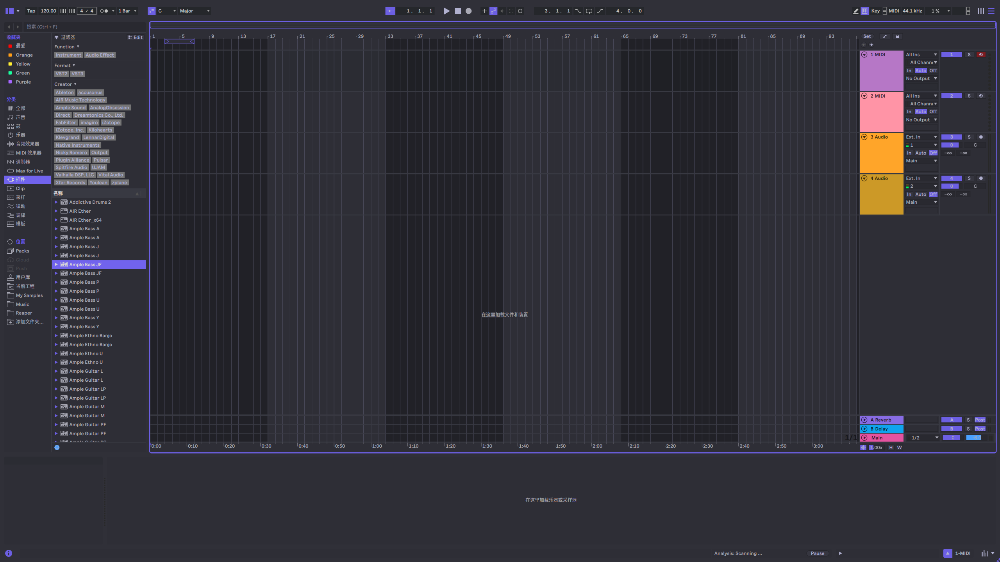

# Violet: An Ableton Live Theme

[简体中文](./README_ZH.MD) | [English](./README.MD)

## 安装

1. 前往  [发布页面](https://github.com/polarissdesu/violet-theme/releases) 下载最新版本。

2. 将主题文件复制到你的 `Ableton\Live 12 Suite\Resources\Themes` 文件夹中.
文件夹的路径像这样：`D:\Program Files\Ableton\Live 12 Suite\Resources\Themes`

3. 前往偏好设置 `Ctrl + ,`，选择 `Appearance` 标签页，然后选择 `Theme` 选项卡并应用 `Violet` 主题。

4. Enjoy!🎹